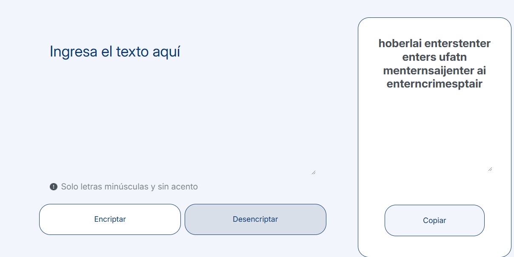

# 🛡️ Encriptador de Textos

**El encriptador de textos** es una aplicación web que te permite encriptar y desencriptar textos de manera sencilla, permitiendo el intercambio de mensajes secretos con otras personas que conozcan las reglas de encriptación utilizadas.

---

## 🎯 Características

- 🔒 **Encriptación de texto:** Convierte un texto en su versión encriptada utilizando reglas específicas.
- 🔓 **Desencriptación de texto:** Convierte un texto encriptado de vuelta a su forma original.
- 📋 **Copiar texto:** Función para copiar fácilmente el texto encriptado o desencriptado al portapapeles.

---

## 🔑 Reglas de Encriptación

Las reglas de encriptación que se aplican en esta aplicación son las siguientes:

| Letra | Encriptado |
|-------|------------|
| e     | enter      |
| i     | imes       |
| a     | ai         |
| o     | ober       |
| u     | ufat       |

### Ejemplo de Encriptación

- **Original:** `gato`
- **Encriptado:** `gaitober`

### Ejemplo de Desencriptación

- **Encriptado:** `gaitober`
- **Desencriptado:** `gato`

---

## ⚙️ Requisitos

- **Letras minúsculas:** La aplicación solo funciona con letras minúsculas.
- **Sin acentos ni caracteres especiales:** No deben utilizarse letras con acentos ni caracteres especiales.

---

## 🚀 Uso

1. ✍️ Ingresa el texto que deseas encriptar o desencriptar en el campo de texto.
2. 🔄 Selecciona la opción de **Encriptar** o **Desencriptar** según lo que necesites.
3. ➡️ El resultado aparecerá en la parte derecha de la pantalla.
4. 📋 Si deseas copiar el resultado al portapapeles, simplemente haz clic en el botón **Copiar**.

---

## 🖼️ Encriptado de texto

Puedes escribir el texto en el área de "Ingresa el texto aquí" luego al presionar el botón **"Encriptar"** aparece el resultado en el lado derecho. Puedes copiar al portapapeles el texto encriptado.

## 🖼️ Desencriptado de texto

Puedes escribir el texto encriptado en el área de "Ingresa el texto aquí" luego al presionar el botón **"Desencriptar"** aparece el resultado en el lado derecho. Puedes copiar al portapapeles el texto desencriptado.

---

## 💻 Tecnologías Utilizadas

- HTML
- CSS
- JavaScript

---

## 🤝 Contribuciones

Las contribuciones son bienvenidas. Si deseas contribuir, por favor, haz un fork de este repositorio y crea un pull request con tus cambios.

---

## 📄 Licencia

Este proyecto está licenciado bajo la [Licencia MIT](./LICENSE).

